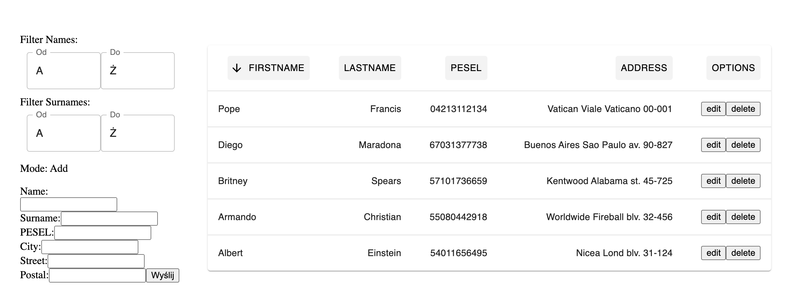

Clinic System

Aplication below has been created as a recrutitment task.
It has been implemented in Reacct.js for front and Python+FastApi+Firebase for back.

Why these techonlogies? 
- Front in React because it is one of the biggest libraries for JS/TS, I know how to use it efficiently and like doing it.
- Back in Python because it has a high level of clarity and fastApi is great
- Firebase for a daatabase beacause anyone firing up this project can use it (after receiving credeentials from me), there isn't any need for creating local databases etc.
- Why even doing backend, when firebase is available directly for web applications? True but without backend server the level of security is much lower, as an added bonus now I can showcase also this skill and knowledge of designing RESTful API.
- Single Page without routing for simplicity, adding react-router-dom wouldn't be a problem :)

this Single Page Application serves as simple system for managing clinic patients:

- adding new patients
- editing existing ones
- deleting them

Add by inputting form at the left bottom side when "Mode" is on "Add" (default)  
Delete by clicking "delete" button on the right side of row  
Edit by clicking on the "edit" button on the right side of row and editing the form on the left side when Mode is "Edit" (automatically switches after pressing "edit" and goes back to "Add" mode afterwards)

You can also filter them by

- first name
- last name

Filtering is available from the left panel of applications

and sort by:

- first name
- last name
- PESEL

Sort by clicking on the columns' names; then there should appear an arrow pointed up or down and pressing again switches mode (from descending to ascending order and back)

**_ HOW TO _**  
to succesfully run the server:  
first terminal (for starting server):  
~ cd back  
~ pip install python-dotenv  
~ pip3 install fastapi  
~ pip3 install uvicorn  
~ uvicorn server:app --reload  

second terminal(for starting frontend app):  
~ cd front  
~ cd clinicFront  
~ npm i  
~ npm run dev  

at the end we open web browser with address listed in terminal after the last command (usually 127.0.0.1:8081)

